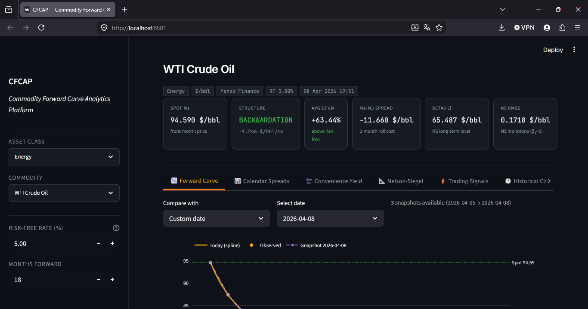
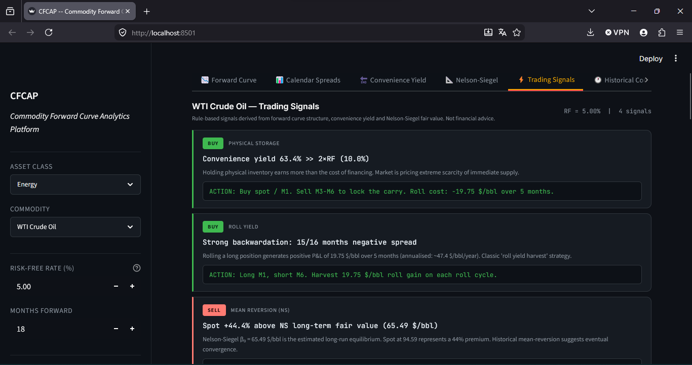
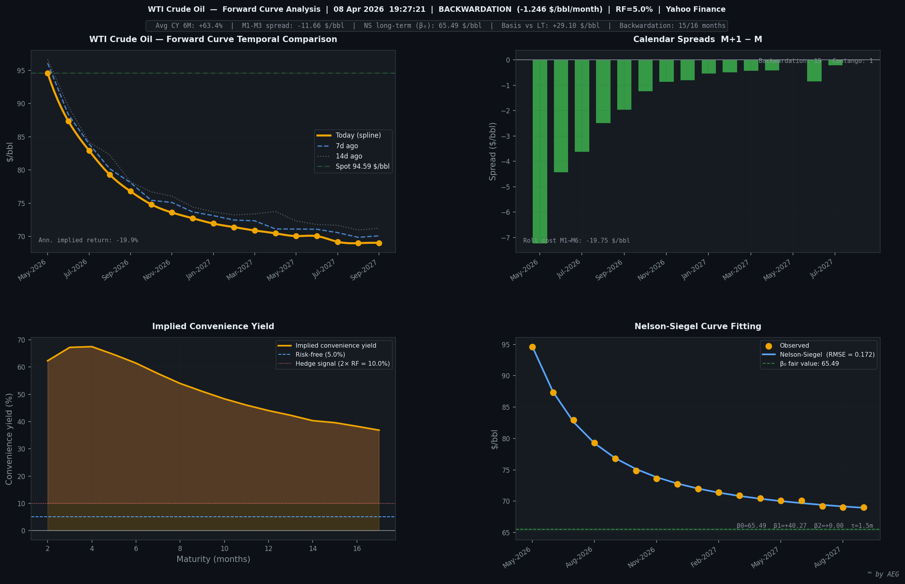

# CFCAP — Commodity Forward Curve Analytics Platform

> A professional-grade commodity forward curve analyzer built in Python.  
> Covers 65+ commodities across 8 asset classes with live data, quantitative analytics, and an interactive Streamlit dashboard.







---

## Features

- **65+ commodities** — Energy, Metals, Agriculture, Base Metals, Freight, Carbon & Environmental
- **Dual data source routing** — Yahoo Finance (grouped download) or TradingView (tvdatafeed)
- **Nelson-Siegel curve fitting** — robust multi-attempt strategy with spot-anchored bounds
- **Implied convenience yield & roll yield** — full term structure
- **Calendar spreads** — M+1−M with backwardation/contango classification
- **51 trading signals** — across 11 categories (carry, roll yield, spreads, NS fair value, temporal, hedging, arbitrage, risk)
- **EIA fundamentals** — US crude/gas inventories, production, spot prices (free API key)
- **Interactive Streamlit dashboard** — Plotly charts, historical date comparison, PNG export
- **Daily scheduler** — automated batch runs at market open with CSV persistence

---

## Installation

```bash
git clone https://github.com/adamelgbouri/commodity-forward-curve-analytics-platform.git
cd cfcap
pip install -r requirements.txt
```

For TradingView-sourced contracts (Jet CIF NWE, LME metals, TTF Gas, Carbon...):
```bash
pip install tradingview-datafeed
```

---

## Usage

```bash
# Interactive dialog + matplotlib dashboard (PNG export)
python cfcap.py

# Interactive browser dashboard (Streamlit)
streamlit run cfcap.py

# Single commodity via CLI
python cfcap.py --commodity "WTI Crude Oil" --family "Energy" --rf 4.25

# Daily scheduler — runs automatically at 09:15 EST
python cfcap.py --schedule

# List saved historical snapshots
python cfcap.py --list
```

1. Select an asset class and commodity in the dialog
2. Set the risk-free rate and number of months forward
3. Click **RUN ANALYSIS**
4. The dashboard is saved in `data/dashboards/<commodity>/`

---

## Data Sources

| Source | Commodities | Notes |
|--------|------------|-------|
| Yahoo Finance | WTI, Brent, NG, Gold, Silver, Copper, Grains, Softs... | Free, no credentials |
| TradingView | Jet CIF NWE, LME metals, TTF, Coal, Carbon, Freight... | Optional credentials |
| EIA Open Data | US crude/gas inventories, production, spot | Free API key at [`eia.gov/opendata`](https://eia.gov/opendata) |

---

## Project Structure

```
cfcap/
├── cfcap.py                 # Main application (single-file)
├── requirements.txt
├── README.md
├── .gitignore
├── LICENSE
└── docs/
    ├── Commodity_Forward_Curve_Analytics_Platform.pdf
    └── Commodity_Forward_Curve_Analytics_Platform.tex

```

Data is generated automatically at runtime and excluded from version control:
```
data/                        # auto-created, gitignored
├── curves/<commodity>/      # daily CSV snapshots
├── dashboards/<commodity>/  # PNG exports
├── eia_cache/               # EIA API cache (24h TTL)
└── logs/                    # scheduler logs
```

---

## Dependencies
 
| Library | Purpose |
|---|---|
| `numpy` | Numerical computations, Nelson-Siegel fitting |
| `pandas` | DataFrames, CSV persistence, historical data |
| `scipy` | Curve fitting (`curve_fit`), spline interpolation |
| `matplotlib` | 4-panel PNG dashboard |
| `requests` | EIA API calls |
| `yfinance` | Live futures data (Yahoo Finance) |
| `streamlit` | Interactive browser dashboard |
| `plotly` | Interactive charts in Streamlit |
| `schedule` | Daily scheduler automation |
| `tkinter` | Desktop selection dialog (built-in) |

---

## Commodities Covered

| Family | Commodities | Source |
|---|---|---|
| Energy | WTI, Brent, Natural Gas, RBOB, Heating Oil, Gasoil | Yahoo Finance |
| Energy+ | Jet CIF NWE, TTF, NBP, Coal API2/API4, Uranium | TradingView |
| Metals | Gold, Silver, Copper, Platinum, Palladium | Yahoo Finance |
| Base Metals | LME Copper, Aluminum, Zinc, Nickel, Lead, Tin, Cobalt | TradingView |
| Agriculture | Corn, Wheat, Soybeans, Sugar, Coffee, Cocoa, Cotton | Yahoo Finance |
| Agriculture+ | Soybean Oil/Meal, Oats, OJ, Cattle, Hogs, Lumber, Palm Oil | Yahoo Finance / TradingView |
| Freight | Capesize, Panamax, Supramax, VLCC | TradingView |
| Carbon | EU EUA, UK UKA, California CCA, RGGI | TradingView |

---

## Trading Signals (51 signals across 11 categories)

- **Convenience Yield** — physical storage, cash-and-carry arbitrage, CY term structure
- **Roll Yield** — carry analysis, roll cost/gain, net carry
- **Calendar Spreads** — M1-M2, M1-M3, M1-M6, butterfly, mixed structure
- **Nelson-Siegel** — fair value mean-reversion, curvature hump/valley, decay speed
- **Structural Regime** — backwardation/contango depth, transitional markets
- **Temporal** — 7-day momentum, curve twist, parallel shift, price acceleration
- **Hedger Signals** — producer hedge, consumer hedge, collar strategy
- **Arbitrage** — reverse cash-and-carry, theoretical forward mispricing
- **Risk** — implied volatility proxy, VaR 95%/99%, curve non-linearity
- **Summary** — STRONG BUY/SELL when 3+ signals aligned

---
## Theory

The forward curve analytics are based on the **Nelson-Siegel (1987)** parametric model:

$$F(T) = \beta_0 + \beta_1 \cdot \frac{1 - e^{-T/\tau}}{T/\tau} + \beta_2 \cdot \left[\frac{1 - e^{-T/\tau}}{T/\tau} - e^{-T/\tau}\right]$$

Where:
- $\beta_0$ — long-term level (fair value as $T \to \infty$)
- $\beta_1$ — slope (short-term component, $\beta_0 + \beta_1$ = spot level)
- $\beta_2$ — curvature (medium-term hump or valley)
- $\tau$ — decay parameter (speed of mean-reversion)

The **implied convenience yield** is derived from the cost-of-carry model:

$$cy(T) = r + u - \frac{1}{T} \ln\left(\frac{F(T)}{S}\right)$$

Where $r$ is the risk-free rate, $u$ the storage cost, $S$ the spot price and $F(T)$ the $T$-maturity futures price.

The **roll yield** measures the annualised return from rolling a long futures position:

$$ry(T) = \frac{S - F(T)}{F(T) \cdot T}$$

See [`docs/Commodity_Forward_Curve_Analytics_Platform.pdf`](docs/Commodity_Forward_Curve_Analytics_Platform.pdf) for the full mathematical write-up.

---
## License

MIT — © 2026 Adam El Gbouri

---

*Built with Python · Yahoo Finance · TradingView · EIA Open Data*
